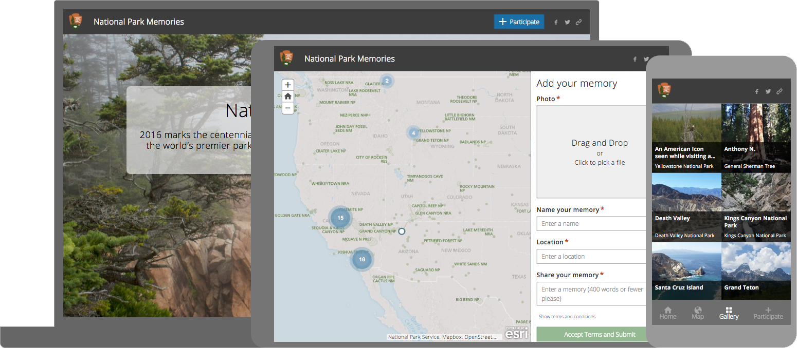

# Story Map Crowdsource
#### Beta Release

The Story Map Crowdsource℠ app enables you to publish and manage a crowdsourced story to which anyone can contribute photos with captions. Use it to engage a specific or general audience on the subject of your choice. To contribute to your story people can sign in with their Facebook, Google, or ArcGIS account, or use a guest option. A vetting function lets you review and approve contributions.

[View it live](https://links.esri.com/storymaps/story_map_crowdsource_overview_1) |
[Download](https://links.esri.com/storymaps/story_map_crowdsource_zip) |
[Crowdsource page on Esri Story Maps website](https://links.esri.com/storymaps/crowdsource-app)

**Latest release is version 0.2.0**, if you want to be informed of new releases, we recommend you to watch this repository ([see GitHub help](https://help.github.com/articles/watching-repositories)). See the [release page](https://github.com/Esri/story-map-crowdsource/releases) for release notes.

For more information about using and customizing Esri's Storytelling Apps follow the [Story Maps Developers' Corner](https://developerscorner.storymaps.arcgis.com).

## Help content

 * [Introduction](#introduction)
 * [Instructions](#instructions)
 * [Feedback / support](#feedback--support)
 * [FAQ](#faq)
 * [Customize the look and feel](#customize-the-look-and-feel)
 * [Issues](#issues)
 * [Contributing](#contributing)
 * [Licensing](#licensing)

## Introduction
A Crowdsource application can be created from [ArcGIS Online](http://arcgis.com) or from [Esri Story Maps website](http://storymaps.arcgis.com/). The story's data are stored in a Web Application Item (this includes the narrative content, reference to the web map and the settings). Contributions to the story are stored in a feature service with photos being stored as feature attachments.
This repository provides the application source code for developers that want to customize Crowdsource.

For more information about the Crowdsource app, including a gallery of examples and a step-by-step tutorial, please see the [Crowdsource](https://links.esri.com/storymaps/crowdsource-app) page on the [Esri Story Maps website](http://storymaps.arcgis.com/).

## Instructions
First create your Crowdsource story in ArcGIS Online using the [step-by-step tutorial](http://storymaps.arcgis.com/en/app-list/crowdsource/tutorial/).
Once your story is ready, you have to find its ID in ArcGIS Online. The ID is a 32 character string that you will find in your web browser's address bar when you are viewing your series.

1. [Download the application](https://links.esri.com/storymaps/story_map_crowdsource_zip)
2. Deploy the application on your webserver. See [FAQ](#how-to-deploy-the-application-on-a-web-server) for details
3. Edit index.html, find the configuration section on line 24 and paste in your application ID
4. Navigate to index.html (e.g., `https://www.example.org/StoryMapCrowdsource/index.html`)

Enjoy!
You can continue to use the builder in ArcGIS Online to modify your story.

## Feedback / support
We would love to hear from you!
* [StoryMaps Website](http://storymaps.arcgis.com/)
* [Let us know about your application](http://storymaps.arcgis.com/en/gallery/submission-form/)
* [Story Maps forum on GeoNet](https://links.esri.com/storymaps/story_maps_geonet)
* [@EsriStoryMaps](http://twitter.com/EsriStoryMaps)
* [ArcGIS Blog](http://blogs.esri.com/esri/arcgis/)

When you contact us, don't hesitate to include a link to your application to make it easier for us to understand what you are working on.

## FAQ

### What should I check before publishing a Crowdsource?
We recommend that you perform the following checks before sharing your Crowdsource with your audience:
 - Check that all your content is shared with your audience (webmaps, medias, ...). Typically you can use another computer than the one you have used to build your story to make sure everything is loading properly. Alternatively [this article](http://browsers.about.com/od/faq/tp/Incognito-Browsing.htm) will show you how to configure your browser for an incognito session or you can just sign-out from ArcGIS Online and any service that you have used to host your resources.
 - Try the application on different browsers, screen resolutions and mobile devices. You can [emulate mobile  devices](http://mobiletest.me/) inside your desktop browser.

### What are the supported browsers?
Crowdsource is supported on Internet Explorer 11 and above, Chrome, Firefox, Safari and the most recent tablet and smartphone devices.

We actively test the application in all major browsers but if you experience difficulties especially with the builder, we recommend that you use [Chrome](https://www.google.com/intl/en_us/chrome/browser/).

### Security

#### Can I keep my Crowdsource private?
Yes, the regular ArcGIS Online security model applies.
By default your Crowdsource is private, you can share it through Crowdsource builder or ArcGIS Online.
When you share your Crowdsource, it is your responsibility to make sure that all the resources of your Series (webmaps, images, videos) are accessible to your audience.

#### Who can edit my Crowdsource?
A Crowdsource can be edited by its owner (the named account that initially created the Crowdsource), organization administrators or users in a group that has been given update permissions if the app is shared into that group.

#### Can I use private web map or layer?
Yes.

When the Crowdsource is hosted in ArcGIS Online, users that don't have access to the Crowdsource or a webmap used in the Crowdsource will be redirected to the ArcGIS Online sign-in page. It is not possible to display an authentication dialog in the Story Map Crowdsource when the story is hosted in ArcGIS Online.

When the Crowdsource is hosted on your web server, an authentication dialog will appear inside the application.

If you are using secured services but don't want users to have to authenticate, you can use a proxy to store the username/password to be used, see [Working with Proxy Services](https://developers.arcgis.com/authentication/working-with-proxies/#selfhosted-proxy-service), and add a proxy rules to specify what services need to use the proxy by editing `PROXY_RULES` in `app/config.js`.

### Deployment
Deploying a Story Map Crowdsource requires you to use ArcGIS Online. The story's content have to be created using the Crowdsource builder and will live in a Web Application Item.

#### Can I use the template without ArcGIS Online?
This is not a supported use case at that time. Please let us know if you are interested by such a scenario.
Crowdsource relies heavily on the Portal for ArcGIS API but it is doable to modify the application to support other scenarios.

#### Where is the data stored?
The story's data are stored in a Web Application Item (this includes the narrative content, reference to the web map and the settings). Contributions to the story are stored in a feature service with photos being stored as feature attachments.

#### Can I use the builder with the downloadable?
Yes, when the template is configured with an application ID, adding the URL parameter 'edit' will open the builder. You will be prompted for user authentication through the Identity Manager.

#### How to deploy the application on a web server?
If you are not familiar with web servers here is three solutions:
 * Use a free hosting service like [Dropbox](https://www.dropbox.com), you may have to [configure Dropbox to enable webpage hosting](https://www.dropbox.com/enable_public_folder)
 * Use the web server that comes with your server Operating System. On Windows this is Internet Information Services (IIS), if you have a `C:\inetpub\wwwroot` folder on your computer, you should be able to access it's content using `http://localhost`
 * On Windows or Mac OS, use a simple web server like [Mongoose](https://code.google.com/p/mongoose/) (not recommended for production)

#### Can I use a single deployment of Story Map Crowdsource for multiple stories?
Yes.
If you have customized the application and deployed it on your server, you don't need to copy it multiple times, edit index.html and paste a different application ID for each story you want to publish.

Instead edit `index.html`, locate the `configOptions` section and fill the `authorizedOwners` property with the ArcGIS Online login of the owner(s) of the Crowdsource you want to use. This make possible for the application to display any of the Crowdsource created by the specified user(s) through an URL parameter.

Example of the same application displaying two stories:
 * http://example.com/StoryMapCrowdsource/index.html?appid=c7ad1a55de0247a68454a76f251225a4
 * http://example.com/StoryMapCrowdsource/index.html?appid=d8j3g855de0247a68454a76f251225a5

## Customize the look and feel

### Custom color theme
As Crowdsource doesn't yet offer the ability to create a custom theme through the builder.

For example if you are using the tabbed layout and have kept the default theme, open `app/config.js`, locate the `LAYOUT` property and edit the following line with the desired colors.

Most of the look and feel customization can be done using the [regular Application Download](https://links.esri.com/storymaps/story_map_crowdsource_zip) and including the css/html overrides directly into `index.html`.

As the application Javascript and CSS are minified, **we don't recommend that you directly edit those files** (e.g. `main-app.min.css`, `main-app.min.js`, ...). In addition to being hard to edit, this will make application update complex for you.

The easiest way to find the id or path of a DOM element that you want to customize is to use your browser developer tool, read documentation for [Chrome](https://developers.google.com/chrome-developer-tools/), [Safari](https://developer.apple.com/library/safari/documentation/AppleApplications/Conceptual/Safari_Developer_Guide/Introduction/Introduction.html), [Firefox](https://getfirebug.com/).

Customization can achieved through the `style` tag already present for you in `index.html` (search for `/* CUSTOM CSS RULES */`).

## Issues
Find a bug or want to request a new feature?  Please let us know by submitting an issue.

## Contributing
Esri welcomes contributions from anyone and everyone. Please see our [guidelines for contributing](https://github.com/esri/contributing).

## Licensing
Copyright 2016 Esri

Licensed under the Apache License, Version 2.0 (the "License");
you may not use this file except in compliance with the License.
You may obtain a copy of the License at

   http://www.apache.org/licenses/LICENSE-2.0

Unless required by applicable law or agreed to in writing, software
distributed under the License is distributed on an "AS IS" BASIS,
WITHOUT WARRANTIES OR CONDITIONS OF ANY KIND, either express or implied.
See the License for the specific language governing permissions and
limitations under the License.

A copy of the license is available in the repository's [LICENSE.txt](LICENSE.txt) file.

Some open-source components of this project are licensed under other License terms, see `src/lib/` folder for respective license files.

| Library               | License   |
| --------------------- | --------- |
| Bootstrap (Sass) |	MIT |
| EventEmitter |	Public Domain |
| Redux |	MIT |
| React Redux |	MIT |
| RequireJS i18n |	BSD and MIT |
| Jquery |	MIT |
| React |	BSD |
| Velocity |	MIT |
| Bourbon |	MIT |
| CropperJS |	MIT |
| Loader |	MIT |
| SmartCrop JS |	MIT |
| Resample Hermite |	MIT |
| Autosize |	MIT |
| Clipboard JS |	MIT |
| URI |	MIT |
| AutolinkerJS |	MIT |
| xss |	MIT |

